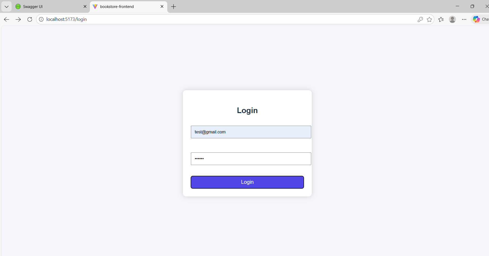
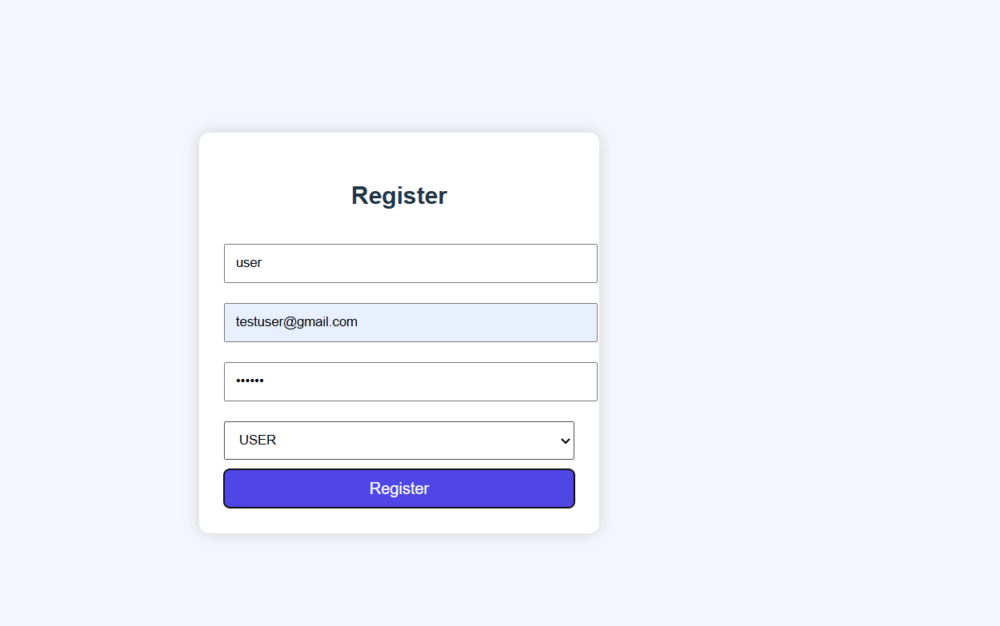
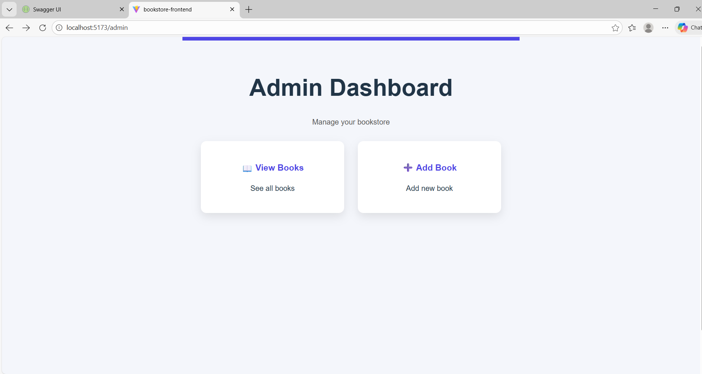
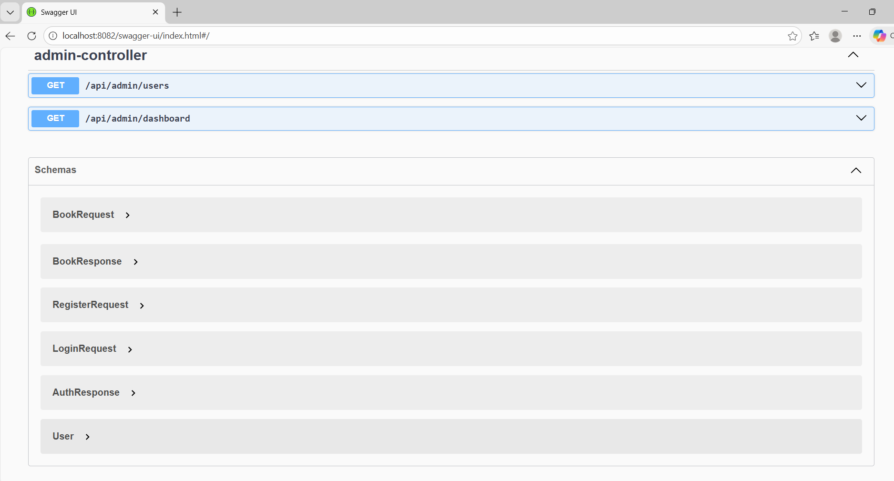

# 📚 Bookstore Management System

A full-stack **Bookstore Management System** developed using **Spring Boot**, **JWT Authentication**, **MySQL**, and **React (Vite)**.  
This project supports **role-based access** for Admin and User with secure REST APIs.

---

## 🚀 Tech Stack

### Backend
- Java
- Spring Boot
- Spring Security
- JWT Authentication
- MySQL
- JPA / Hibernate
- Swagger OpenAPI

### Frontend
- React (Vite)
- JavaScript
- Axios
- React Router DOM
- CSS

---

## ✨ Features

### 🔐 Authentication & Authorization
- User Registration
- User Login
- JWT-based authentication
- Role-based access (ADMIN / USER)

### 👑 Admin Features
- Admin Dashboard
- View all books
- Add new books
- Secure admin-only APIs

### 👤 User Features
- User Dashboard
- View available books
- Secure user-only access

---

## 🖥 Screenshots

### Login Page


### Register Page


### Admin Dashboard


### User Dashboard


### Swagger API Documentation


---

## ▶️ How to Run the Project

### 📌 Backend (Spring Boot)

```bash
cd bookstore
.\mvnw spring-boot:run
